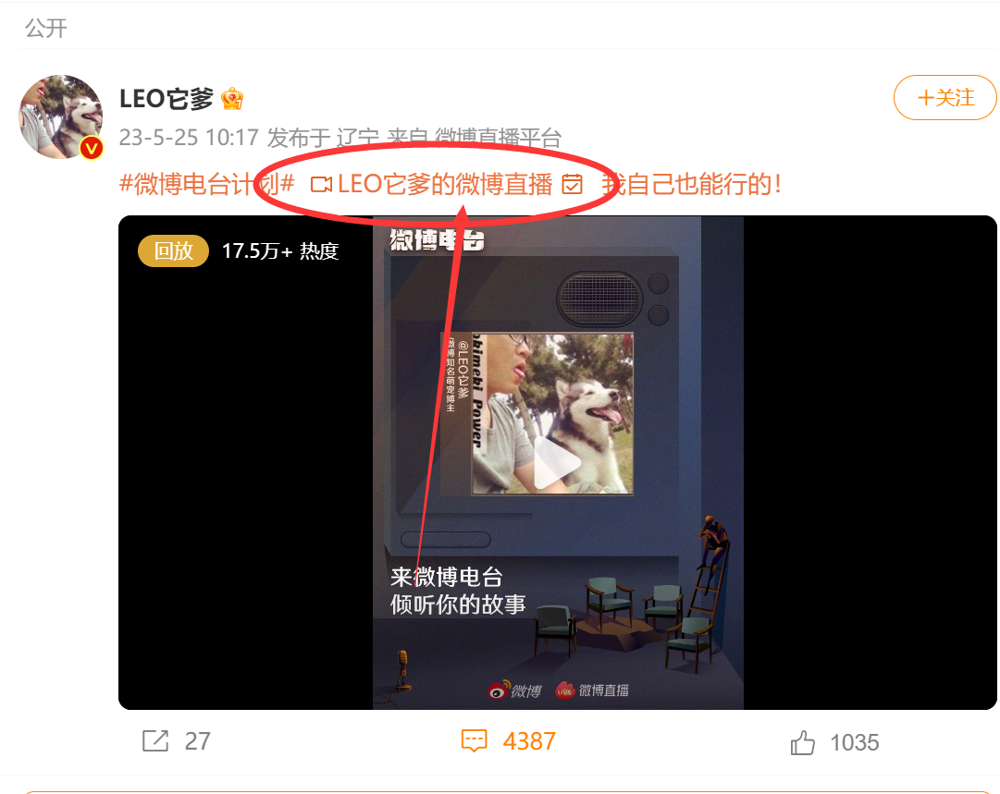
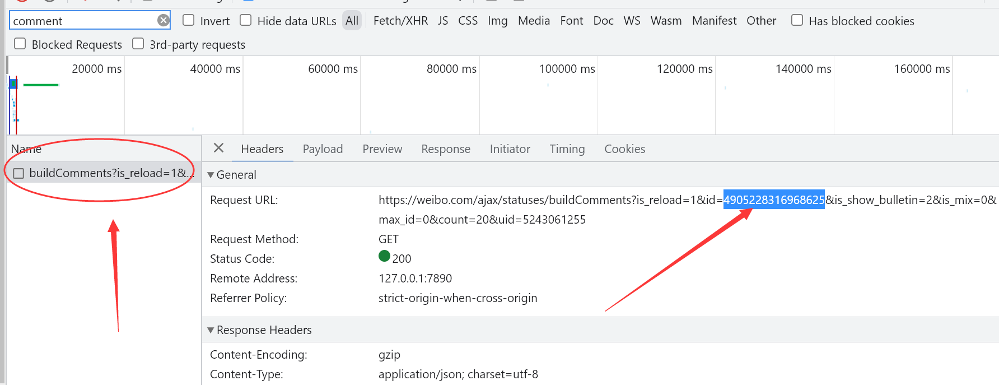

# 使用方法
## 1.输入 Cookie
打开浏览器，进入微博，登录你的账号(尽量不要使用重要的账号，建议使用小号)后回到微博首页。然后按键盘上的F12按键(或右键任意地方点击审查元素或检查等)，打开开发者工具，点击网络(NetWork)，然后刷新网页，你会看到出现一堆内容(前提是筛选Filter是空白的)。随便点击一个，查看是否有Cookie这一项，如果没有，再随便点击一个，直到找到Cookie，如下图所示。

将 Cookie 冒号后面的内容复制到 cookie.txt 中

点进直播的详情页，如图

新版微博以 https://weibo.com/5243061255/N2c0LteRb 为例。

点进去是这个链接

https://weibo.com/l/wblive/p/show/1022:2321324905228175540513

按键盘上的F12按键(或右键任意地方点击审查元素或检查等)，打开开发者工具，点击网络(NetWork)，在筛选器(Filter)中输入`comment`，然后刷新网页。

接着会看到一个数据包 `https://weibo.com/ajax/statuses/buildComments?is_reload=1&id=4905228316968625&is_show_bulletin=2&is_mix=0&max_id=0&count=20&uid=5243061255`，点击它

其中`id=4905228316968625`中的`4905228316968625`就是要找的id

启动软件，输入 id 即可获取弹幕。

注意，因网络问题可能提前结束获取，导致获取的弹幕不完整，如果出现，多获取几次试试。

